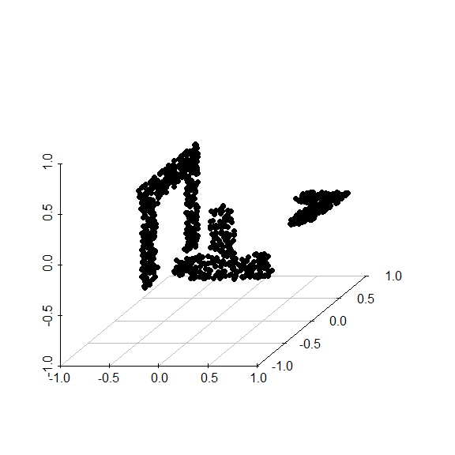
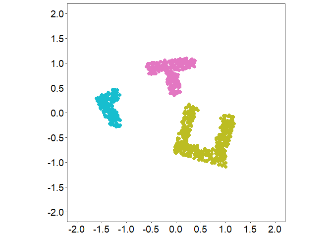
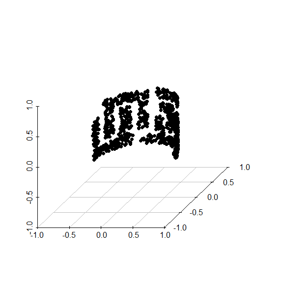
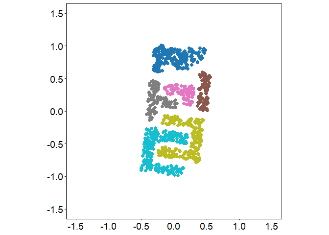

## `Cluster + Embed` Tutorial

Load the source files

    source("./scripts/generate_data.R")
    source("./scripts/cluster_embed.R")
    source("./scripts/utils.R")
    source("./scripts/eval.R")

Synthetic data can be loaded using the following,

    data <- load_data("shapes_3d", n = 1000)
    X <- data$X
    labels <- data$labels
    euclidean_distances <- dist(X) 

    head(X)

    ##                X            Y            
    ## [1,] -0.06041000  0.310006776 -0.46812162
    ## [2,]  0.86649375  0.007431779 -0.04004044
    ## [3,]  0.01135655  0.310006776 -0.55024520
    ## [4,] -0.26263288 -0.811762729  0.38240368
    ## [5,] -0.25084630  0.310006776 -0.62531027
    ## [6,] -0.26263288  0.188443039 -0.12817896

In the synthetic example, the data is in ℝ3, so we can
visualize the original data.

    library(scatterplot3d)

    scatterplot3d(
      x = X[, 1:3], pch = 16, box = FALSE, tick.marks = TRUE,
      xlab = "", ylab = "", zlab = "",
      xlim = c(-1, 1),
      ylim = c(-1, 1),
      zlim = c(-1, 1),
      cex.lab = 1,
      cex.axis = 1,
      cex.symbols = 1
    )

For the first step of the C+E method, any clustering method can then be
used to cluster the data. In this example, we use DBSCAN.

    clusters <-  dbscan(X, eps = .1, minPts = 10)$cluster
    table(clusters)

    ## clusters
    ##   1   2   3 
    ## 296 192 512

The embedding is obtained using the `cluster_align` function. Here, each
cluster is embedded via PCA and the clusters are aligned to minimize
Kruskal’s formulation of the stress. The parameter `alpha` can also
(optionally) be set to increase separation between clusters in the
embedding.

    out<- cluster_align(euclidean_distances, clusters,
        embedding_method = "PCA",
        alignment_method = "stress",
        use_grad = T,
        alpha = 1.42
      )
    ce_embedding <- out$embeddings

Visualize the result using the ground truth labels. The `scale` function
centers the obtained embedding.

    df <- as_tibble(scale(ce_embedding, scale = F))
    colnames(df) <- c("V1", "V2")
    df$labels <- as.factor(labels)

    plot(df, 2,2, cmap = "shapesII")

With real world data, Euclidean distance may not capture the intrinsic
dissimilarity between two observations well and other notions of
dissimilarity may be more appropriate to work with.

Here we demonstrate a simple synthetic example with data on the surface
of a half cylinder.

    data <- load_data("shapes_cylinder", n = 1000)
    X <- data$X
    labels <- data$labels
    euclidean_distances <- dist(X) 

    head(X)

    ##            [,1]      [,2]        [,3]
    ## [1,]  0.3242902 0.5478326 -0.31982327
    ## [2,]  0.3751284 0.5143573  0.18101148
    ## [3,] -0.6191849 0.1479687 -0.31390523
    ## [4,] -0.3414551 0.5373017  0.31911426
    ## [5,]  0.5807853 0.2607166  0.17638719
    ## [6,] -0.1341867 0.6223172  0.09350061

    scatterplot3d(
      x = X[, 1:3], pch = 16, box = FALSE, tick.marks = TRUE,
      xlab = "", ylab = "", zlab = "",
      xlim = c(-.8, .8),
      ylim = c(-.8, .8),
      zlim = c(-.8, .8),
      cex.lab = 1,
      cex.axis = 1,
      cex.symbols = 1,
      angle = 45
    )

Below we calculate the geodesic distance. If the dataset is large, it is
recommended to save these distances as initial distance calculation can
be slow. This can be done by running
`calculate_geodesic_distances(euclidean_distances,k = k, save = TRUE, path = 'path_to_data.csv')`.
The distances can be loaded as a `dist` object by running
`geodesic_distances <- load_geodesic_distances("path_to_data.csv", n = n)`.

    geodesic_distances <- calculate_geodesic_distances(euclidean_distances,
      k = 100, save = FALSE) #k need to be large enough so the kNN graph has only one connected component 

Then, the C+E approach can be applied to these distances. In our
real-world examples we find that the Leiden algorithm performs well for
clustering the data. Here, we obtain 9 clusters (there are 6 ground
truth clusters).

    clusters<- get_leiden_clustering(geodesic_distances, k = 50, resolution = 2/3)
    table(clusters)

    ## clusters
    ##   1   2   3   4   5   6   7   8   9 
    ##  97 122 145 130 106 115 102  92  91

We then embed each cluster and align the clusters. Note that when we
input the geodesic distances to the `cluster_align` function and set the
embedding method to PCA, this is equivalent to embedding each cluster
via Isomap.

    out<- cluster_align(geodesic_distances, clusters,
        embedding_method = "PCA",
        alignment_method = "stress",
        use_grad = T,
        alpha = 1
      )
    ce_embedding <- out$embeddings

And visualize the final embedding using the ground truth clustering for
coloring:

    df <- as_tibble(scale(ce_embedding, scale = F))
    colnames(df) <- c("V1", "V2")
    df$labels <- as.factor(labels)

    plot(df, 1.5,1.5, cmap = "shapesI")

